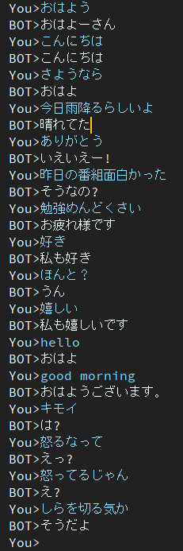

# Dialog
Dialog is japanese chatbot project.  
Used architecture in this project is Seq2Seq model that has BERT Encoder and Transformer Decoder.

Note that this seq2seq model cannot use information of conversation history.  
But I think Recurrence mechanism described in Transformer-XL may help to acquire long-dependency.  
If you have the solution about this, please write in issues.

[Article](https://qiita.com/reppy4620/items/e4305f22cd8f6962e00a) written in Japanese.

# Result
2epochs



This model has still contain the problem about dull response.  
To solve this problem i'm researching now.  

Then I found the paper tackled this problem.

[Another Diversity-Promoting Objective Function for Neural Dialogue Generation](https://arxiv.org/abs/1811.08100)

Authors belong to the Nara Institute of Science and Technology a.k.a NAIST.  
They propose the new object function of Neural dialogue generation.  
I hope that this method can help me to solve that problem.  

# Usage
### Install packages.
Maybe, Needed packages are

- pytorch
- transformers
- tqdm
- Mecab

If occur errors because of the packages, please install missing packages.

### Prepare conversation data.

#### My Dataset
training data:  [this](https://drive.google.com/open?id=1wYrUQHb4Wg2T8ZvCleIBcGu7PTaFw6VO)  
Please use pkl data if you wanna train.
- Change path in config.py

if you wanna get more conversation data, please use get_tweet.py

##### Usage of get_tweet.py
Note that you need to change consumer_key and access_token in order to use this script because of using Twitter api.
```bash
$ python get_tweet.py "query" "Num of utterances"
Example
$ python get_tweet.py 私は 5
```
if you execute the Example command, script start to collect consecutive 5 sentences if last sentence contains "それは草".

### Excecute
if you're ready to start training, run the main script.
```bash
$ python main.py
```

# Architecture
- Encoder: [BERT](https://arxiv.org/abs/1810.04805)  
- Decoder: [Vanilla Transformer's Decoder](https://arxiv.org/abs/1706.03762)

- Loss: CrossEntropy
- Optimizer: AdamW

- Tokenizer: BertJapaneseTokenizer


If you want more information about architecture of BERT or Transformer, please refer to the following article.

- [The Annotated Transformer](http://nlp.seas.harvard.edu/2018/04/03/attention.html)
- [The Illustrated Transformer](http://jalammar.github.io/illustrated-transformer/)
- [transformers](https://github.com/huggingface/transformers)
